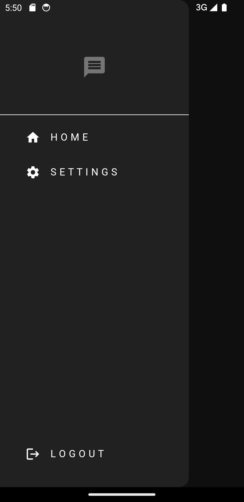
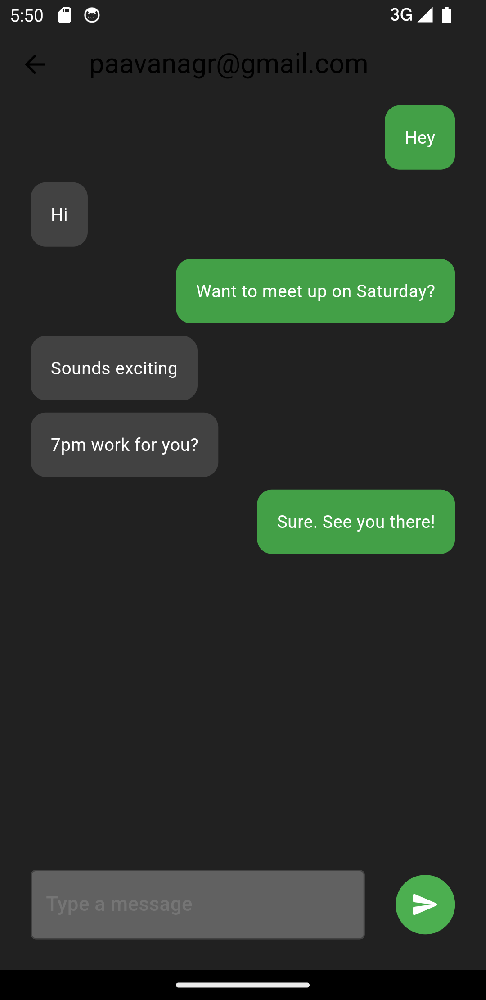

# Chat App

## Version 1.0

A basic chat application with functionality for reporting and blocking users. This app allows users to engage in real-time conversations while providing features to maintain a safe and controlled chat environment.

## Features

- **Real-time Messaging**: Communicate with other users in real-time.
- **Report Functionality**: Report inappropriate messages or users.
- **Block Functionality**: Block users to prevent unwanted interactions.

## Screenshots

### Light Mode

<div align="center">
  <table style="border: 0px">
    <tr>
      <td>
        
      </td>
      <td>
        
      </td>
      <td>
        
      </td>
    </tr>
    <tr style="text-align: center">
      <td>Login Screen</td>
      <td>Register Screen</td>
      <td>Home Screen</td>
    </tr>
    <tr>
      <td>
        
      </td>
      <td>
        
      </td>
      <td>
        
      </td>
    </tr>
    <tr style="text-align: center">
      <td>Drawer Menu</td>
      <td>Chats Screen</td>
      <td>Chat Message Options</td>
    </tr>
    <tr>
      <td>
        
      </td>
      <td>
        
      </td>
      <td>
        
      </td>
    </tr>
    <tr style="text-align: center">
      <td>Report Message</td>
      <td>Block User</td>
      <td>Unblock user</td>
    </tr>
    <tr>
      <td>
        
      </td>
      <td>
        
      </td>
    </tr>
    <tr style="text-align: center">
      <td>Settings Screen</td>
      <td>Blocked Users Screen</td>
    </tr>
  </table>
</div>

### Dark Mode

<div align="center">
  <table style="border: 0px">
    <tr>
      <td>
        
      </td>
      <td>
        
      </td>
      <td>
        
      </td>
    </tr>
    <tr style="text-align: center">
      <td>Login Screen</td>
      <td>Register Screen</td>
      <td>Home Screen</td>
    </tr>
    <tr>
      <td>
        
      </td>
      <td>
        
      </td>
      <td>
        
      </td>
    </tr>
    <tr style="text-align: center">
      <td>Drawer Menu</td>
      <td>Chats Screen</td>
      <td>Chat Message Options</td>
    </tr>
    <tr>
      <td>
        
      </td>
      <td>
        
      </td>
      <td>
        
      </td>
    </tr>
    <tr style="text-align: center">
      <td>Report Message</td>
      <td>Block User</td>
      <td>Unblock user</td>
    </tr>
    <tr>
      <td>
        
      </td>
      <td>
        
      </td>
    </tr>
    <tr style="text-align: center">
      <td>Settings Screen</td>
      <td>Blocked Users Screen</td>
    </tr>
  </table>
</div>

## Installation

### Prerequisites

- Flutter SDK (>=3.5.1)

### Clone the Repository

```sh
git clone https://github.com/agrpaavan/flutter-chat-app.git
cd chat-app
```

### Install Dependencies

```sh
flutter pub get
```

### Setup Firebase Configuration

1. **Create `secrets.dart` File**:
   - Inside the `lib/` folder, create a file named `secrets.dart`.
   - Add your Firebase configuration details to `secrets.dart`. Replace the placeholders with your actual Firebase project credentials:

     ```dart
     const String firebaseAuthAndroidApiKey =
         "YOUR_FIREBASE_ANDROID_API_KEY";
     const String firebaseAuthAndroidAppId =
         "YOUR_FIREBASE_ANDROID_APP_ID";
     const String firebaseAuthAndroidMessagingSenderId = "YOUR_FIREBASE_ANDROID_MESSAGING_SENDER_ID";
     const String firebaseAuthAndroidProjectId = "YOUR_FIREBASE_ANDROID_PROJECT_ID";
     const String firebaseAuthAndroidStorageBucket =
         "YOUR_FIREBASE_ANDROID_STORAGE_BUCKET";

     const String firebaseAuthIosApiKey = "YOUR_FIREBASE_IOS_API_KEY";
     const String firebaseAuthIosAppId =
         "YOUR_FIREBASE_IOS_APP_ID";
     const String firebaseAuthIosMessagingSenderId = "YOUR_FIREBASE_IOS_MESSAGING_SENDER_ID";
     const String firebaseAuthIosProjectId = "YOUR_FIREBASE_IOS_PROJECT_ID";
     const String firebaseAuthIosStorageBucket = "YOUR_FIREBASE_IOS_STORAGE_BUCKET";
     const String firebaseAuthIosBundleId = "YOUR_FIREBASE_IOS_BUNDLE_ID";
     ```

1. **Create `key.properties` File**:
   - You will need this when you build your app to sign the APK.
   - Inside the `android/` folder, create a file named `key.properties`.
   - Add your keystore configuration details to `key.properties`. Replace the placeholders with your actual keystore information:

     ```properties
     storePassword=YOUR_KEYSTORE_PASSWORD
     keyPassword=YOUR_KEY_PASSWORD
     keyAlias=upload
     storeFile=C:\\Users\\paava\\upload-keystore.jks
     ```

### Run the App

Connect an Android or IOS device or start an emulator, then run:

```sh
flutter run
```

## APK Download and Installation

You can download the latest APK file from the [Releases](https://github.com/agrpaavan/flutter-chat-app/releases) section of this repository.

### Installation Instructions

1. **Download the APK**:
   - Go to the [Releases page](https://github.com/agrpaavan/flutter-chat-app/releases) and download the latest APK file.

2. **Install the APK**:
   - Ensure that installation from unknown sources is enabled on your device:
     - Go to `Settings` > `Security` > `Install unknown apps` and enable the option for your file manager or browser.
   - Open the downloaded APK file on your device and follow the prompts to install the app.

## Contributing

Feel free to fork this repository and make improvements or suggest features!

1. Fork the repository.
2. Create a new branch for your changes.
3. Commit your changes and push to your branch.
4. Open a pull request to merge your changes.

## Issues

If you encounter any issues or have suggestions, please use the [Issue Tracker](https://github.com/agrpaavan/flutter-chat-app/issues) to report them.

## License

This project is licensed under the MIT License - see the [LICENSE](https://github.com/AgrPaavan/flutter-chat-app/blob/main/LICENSE) file for details.

## Acknowledgments

- [Flutter](https://flutter.dev/) - The framework used for building this app.
- [Material Design](https://material.io/design) - Design system used for UI components.
- **Tutorial**: This project was created following the tutorial by Mitch Koko. You can watch the tutorial [here](https://www.youtube.com/watch?v=TclK5gNM_PM).
